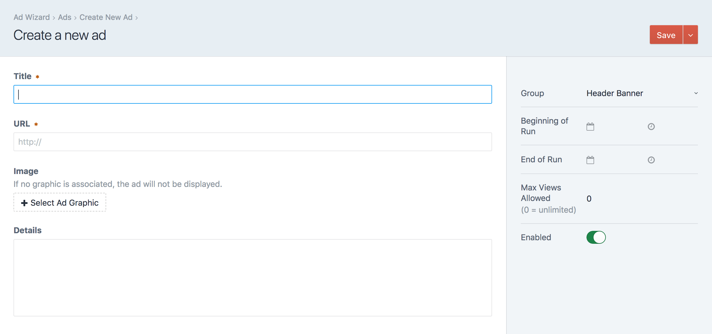
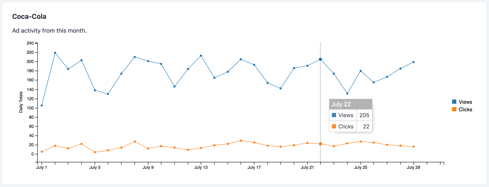
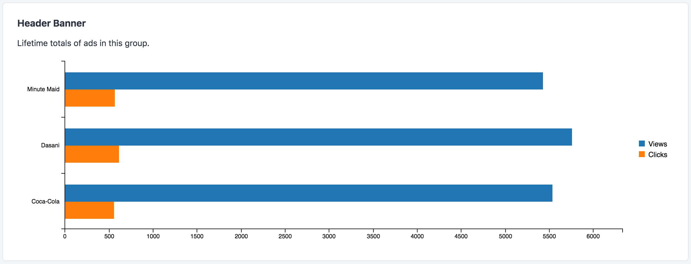

# Ad Wizard plugin for Craft CMS

**Easily manage custom advertisements on your website.**

---

**For complete documentation, see [plugins.doublesecretagency.com/ad-wizard](https://plugins.doublesecretagency.com/ad-wizard/)**

## Create Ads

Manage your ads in the Craft control panel by clicking the "Ad Wizard" tab.



Before you can create any **Ads**, you will first need to create at least one **Group**. Every ad you create will belong to a specific group. Once you've created your ads, you'll then be able to embed them into your Twig templates.

## Embed Ads

You have two Twig tags available to you...

**Render a random ad from a specific group.** Specify the group by its handle.

```twig
{{ craft.adWizard.randomizeAdGroup('rightSidebar') }}
```

**Render a single, specific ad.** Specify the ad by its ID number.

```twig
{{ craft.adWizard.displayAd(42) }}
```

Both methods can display an ad until:
 - The ad expires, or
 - The ad reaches the maximum allowed impressions, or
 - The ad is manually disabled.
 
Read more about [embedding ads...](https://plugins.doublesecretagency.com/ad-wizard/embedding-your-ads/)

## Track Views & Clicks

From the control panel Dashboard, click the settings icon. You can click the "New Widget" button to add a new widget to your dashboard.

Two new widget types will be available to you:
 - **Ad Timeline** - A line chart showing the view/click trends of a single ad over time.
 - **Group Totals** - A bar chart showing the total views/clicks for each ad in a specified group.
 



Read more about [seeing your ad statistics...](https://plugins.doublesecretagency.com/ad-wizard/seeing-your-ad-statistics/)

## Use Image Transforms (supports Retina display)

You can easily apply an image transform to your ads...

```twig
{{ craft.adWizard.randomizeAdGroup('rightSidebar', {
   'image': {
       'transform': 'large',
       'retina': true
   }
}) }}
```

Read more about [image transforms...](https://plugins.doublesecretagency.com/ad-wizard/image-transforms/)

---

## Further Reading

If you haven't already, flip through the [complete plugin documentation](https://plugins.doublesecretagency.com/ad-wizard/).

And if you have any remaining questions, feel free to [reach out to us](https://www.doublesecretagency.com/contact) (via Discord is preferred).

**On behalf of Double Secret Agency, thanks for checking out our plugin!** 🍺

<p align="center">
    
</p>
